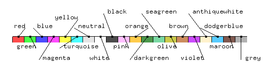
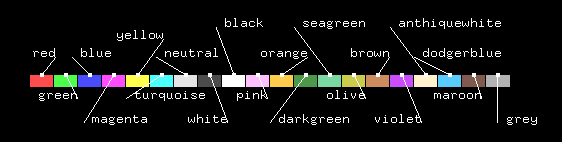

# My Calculix

This is related to CrunchiX (CCX) and Graphix (CGX). This is not a fork of [Calculix](http://calculix.de/), rather the place where I share some of my:
- help files
- tips
- configuration files
- examples
- documents gathered on the web related to Calculix or meshing tools

## Comparison with other codes
External documents comparing Calculix performance to other FEM codes.
[Thesis of Dilip Neupane about  static analysis](https://www.theseus.fi/bitstream/handle/10024/87106/Neupane_Dilip.pdf)

## Configuration
These are configuration files for CGX. In linux systems all files or folders starting with a "." are hidden so I replaced "." by "dot_".
The folder *dot_cgx_user* has a few macro to set isometric views of model. These macros are This folder needs to be copied in your home and rename as *.cgx_user*. The path to this folder needs to be updated in ".cgx" file since it shows the path of my home.

### .cgx file
Commands in ".cgx" file are executed at CGX startup. Font sizes, display of elements, ruler and initial view are setp up. You can see the comments in the file to understand the customization.
I added 3 user commands displayed in the user menu. These commands are ".fbl" files stored in ".cgx_user" folder.
I created additional colors to be used for showing sets. You can have a look with the following pictures.

The model shown in the picture is available with 2 files:
- cgx_color_demo.fbd: set up the colors and text labels
- cgx_color_demo.inp: model with colored element sets

## Contact documents
[Thesis of Jaro Hokkanen about segment-to-segment penalty contact](https://core.ac.uk/download/pdf/80711571.pdf).

[Thesis of Saskia Sitzmann about robust algorithms for contact](https://opus4.kobv.de/opus4-fau/files/7198/dissertation_sitzmann_saskia.pdf)

## Help
### Two HTML files help to reach CCX and CGX HTML files:
- *ccx_extract.html*: link to HTML keywords for CCX documentation.
- *cgx_quick_reference.html*: link to HTML keywords for CGX documentation.
These files should be copied to the CCX or CGX HTML documentation folder.

### Two HTML files with tips gathered from forums or documentations:
- *ccx_tips.html*
- *cgx_tips.html*

## Tutorials
HTML files linking to video tutorials for:
- Finite Element Method
- CCX, CGX, Netgen, FreeCAD and GMSH. CCX remains the solver.

## CCX_examples_my_choice.ods
LibreOffice spreadsheet with my choice of CCX examples from [Calculix](http://calculix.de/), mainly mechanical (contact, frequency, linear and non-linear). No CFD, no electromagnetics and no heat.
Main features of exemples are stored to ease the search for examples based on topics.
Feel free to add missing examples and to open an issue to share you examples.

Other interesting materials can be found at [Calculix on Github](https://github.com/calculix)
